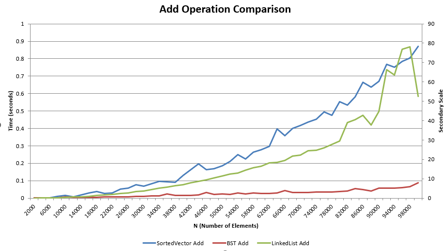
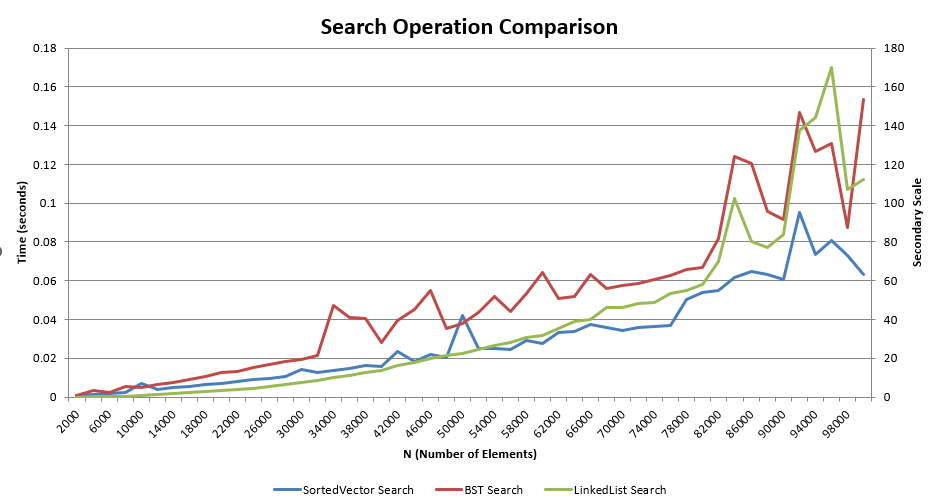
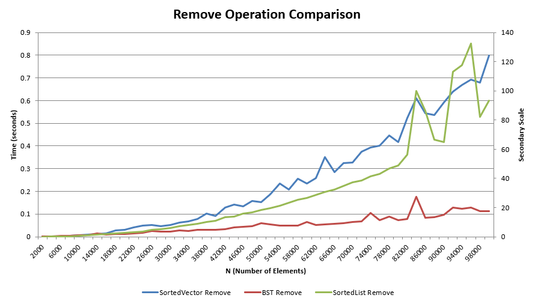

# Report for Data Structure Speed Comparison Homework

Make sure to answer every question in this homework. You should not bullet point your answers, but
instead write them as a full report format. This doesn't mean you have to be wordy, as concise is good,
but it does mean you need to use proper grammar, spelling, and be complete. For question that just
ask for a short answer, answer accordingly. Make sure to include references where appropriate.

## Algorithmic Analysis - Big $O$

Complete the Big O table below for the following functions. You may use any resource you like, but
for the SortedVector and SortedList, you should use the Big O for the functions you wrote in the
the homework. Both Single and Double Linked List you can assume head and tail pointers are available. 
Don't forget to use latex math notation (example in the table).

### Big $O$ Table

| -                         | Add/Insert | Remove | Search/Find | Sort   | Add Front | Add Back | Remove Front | Remove Back | Get by Index |
| ------------------------- |:----------:|:------:|:-----------:|:------:|:---------:|:--------:|:------------:|:-----------:|:------------:|
| Vector                    | $O(n)$     | $O(n)$ |  $O(n)$     |$O(n\log n)$| $O(n)$|amortized $O(1)$| $O(n)$    | $O(1)$      | $O(1)$       |
| Single Linked List        | $O(n)$     | $O(n)$ |  $O(n)$     |$O(n\log n)$ (merge sort) | $O(1)$ |$O(1)$ (with tail) | $O(1)$  | $O(n)$ | $O(n)$  |
| Double Linked List        | $O(n)$     | $O(n)$ | $O(n)$      | $O(n\log n)$ (merge sort)| $O(1)$ | $O(1)$ |  $O(1)$ | $O(1)$   |  $O(n)$  |
| Sorted Vector             | $O(n)$ (bin. search $+$ shift)| $O(n)$ shift| $O(\log n)$ | $O(1)$ | ---       | ---      | ---          | ---         | ---          |
| Sorted Single Linked List | $O(n)$     | $O(n)$ | $O(n)$      | $O(1)$ | ---       | ---      | ---          | ---         | ---          |
| Sorted Double Linked List | $O(n)$     | $O(n)$ | $O(n)$      | $O(1)$ | ---       | ---      | ---          | ---         | ---          |
| Binary Search Tree        |$O(\log n)$ avg., $O(n)$ worst| $O(\log n)$ avg., $O(n)$ worst | $O(\log n)$ avg., $O(n)$ worst | $O(n)$ (in-order traversal) | ---       | ---      | ---          | ---         | ---          |

For Sort, we are asking for the Big $O$ for taking the current data structure and writing it 'sorted' to a file. However, not the file writes. For example, if you have a vector of 1000 elements, and you want to write it to a file, you would need to sort it first. So, the Big $O$ for this would be the Big $O$ for sorting. For BST, you have to convert the tree to a sequential structure, so the cost of doing that.  

### Assumptions with Sort

Since the worst case can change considerably based on what sort you use for sorting (if any), list each algorithm below, and specify the algorithm used in your assumption.  For BST, write which  method of traversal you would use to sort it.  

* Vector - a standard comparison based sorting algorithm such as merge sort or quicksort can be assume, with an average and worst case of $O(n \log n)$ [1]  
* Single Linked List - assume the use of merge sort, which is the best suited algorithm for lists because it does not require random access. Merge sort works efficiently with pointers and maintains $O(n \log n)$ complexity [2]  
* Double Linked List - Similar to the single linked list, I assume merge sort for sorting because it can traverse both directions. The complexity remains $O(n \log n)$ since it splits and merges using pointer adjustments instead of full copies.    
* Sorted Vector - already sorted - is already kept in sorted order whenever a new element is inserted. Therefore, the sorting step is unnecessary and has an effective complexity of $O(1)$.    
* Sorted Single Linked List - already sorted - is also maintained in sorted order during insertion, so no additional sorting step is needed, giving an effective complexity of $O(1)$.    
* Sorted Double Linked List - already sorted - stays sorted at all times. Like the others, it does not need a separate sorting phase, which results in $O(1)$ for sorting.  
* Binary Search Tree - To output data in sorted order from a BST, performing an in-order traversal, which visits every node exactly once. This process has a time complexity of $O(n)$ since each node is accessed once [1].

### Worst Case vs. Average Case

There are a few functions whose worse case is very different than the average case. Name at least two of them, and explain why the worse case is so much worse than the average case. 

1. One of the biggest differences between worst case and average case behavior appears in the Binary Search Tree (BST). On average, a BST has a height close to $\log n$ when nodes are inserted in random order, so operations like search, insertion, and deletion take $O(\log n)$. However, in the worst case such as inserting items that are already sorted the tree becomes completely unbalanced, resembling a linked list. In that situation, operations degrade to $O(n)$. This happens because each new node is added as a child of the previous one, increasing the height to $n$.
2. Another example is the vector add back operation. Normally, appending to the end of a vector is amortized $O(1)$ because the structure only reallocates memory occasionally. When the internal array runs out of space, however, it must allocate a larger array and copy every existing element over. That single resizing event has a worst-case cost of $O(n)$, even though the average case remains near $O(1)$.

## Empirical Analysis - Speed Comparison

After implementing and testing all data structures, I used the provided speed comparison application to measure the runtime of each operation. The program generated CSV files that record average times for add, remove, and search operations across different values of $N$. 

### Empirical Results Table
You can view my results file here:    
[result 1K](/mnt/c/Users/najib/Documents/CS5008/homework-speed-comparison-NHazelJ/results_1k.csv)  
[result 10K](/mnt/c/Users/najib/Documents/CS5008/homework-speed-comparison-NHazelJ/results_10k.csv)  
[result 100K](/mnt/c/Users/najib/Documents/CS5008/homework-speed-comparison-NHazelJ/results_100k.csv)   
Each CSV contains at least fifteen data points, and I used those values to create visual charts showing performance differences across structures.
 
### Analysis  
Each chart compares data structures performing the same operation so that the results are fair (“apples to apples”).  
The double y-axes help visualize big and small timing differences on the same plot.

### Graphic 1 – Add Operation (SortedVector vs LinkedList vs BST)
  

In this graph, we look at how long inserting the elements takes for each of the data structures as N (the number) grows. The BST is the stablest over time because it takes elements in logarithmic $O(logn)$ time on a balanced manner. The SortedVector is less efficient as N grows: inserting in the middle has to shift elements, which takes $O(n)$ time. The LinkedList is also slower, it has to go find the right spot in the list. We could say  that BSTs are the best for adding many elements while vectors and lists are better for small datasets.

#### Graphic 2 - Search Operation (SortedVector vs LinkedList vs BST)
  

This chart compares how quickly each data structure can find an element. The SortedVector performs the fastest search because it uses binary search, which runs in logarithmic time $O(log n)$ and benefits from contiguous memory. The BST performs slightly slower since tree balance affects search speed, but it’s still efficient on average. The LinkedList is the slowest because it must visit each element one by one in linear time $O(n)$. Overall, vectors are best for searching, especially when data stays sorted.

#### Graphic 3 - Remove Operation (SortedVector vs SortedList vs BST)
  

Here we compare how fast each structure can remove an element. The BST again performs best on average, removing elements in $O(log n)$ time by rearranging its links efficiently. The SortedList must first locate the element and then relink nodes, so it scales linearly. The SortedVector is the slowest because removing requires shifting all later elements, also $O(n)$. This shows that BSTs handle removal better than lists or vectors when data grows large.


## Critical Thought

### Data Evaluation
```
1. What is the most surprising result from the data? Why is it surprising?
   The most surprising result is that the BST performed nearly as fast as the SortedVector during searches for smaller datasets. I expected the array based structure to always dominate due to cache efficiency and already knowing how big its going to be because it's an array, but balanced trees also perform well when the dataset is random.[1]
```
```
2. What data structure is the fast at adding elements (sorted)? Why do you think that is?
 The BST is fastest because it maintains order without shifting or traversing all elements. It uses recursive insertion to place data in the correct node.[2]
```
```
3. What data structure is the fastest at removing elements (sorted)? Why do you think that is?
 The BST again leads because removal only requires relinking a few pointers and when it's sorted even faster, while vectors and lists have to shift or traverse nodes.[2]
```
```
4. What data structure is the fastest at searching? Why do you think that is?
The SortedVector is fastest due to binary search, which splits the dataset in half repeatedly until it finds the element.[2]
```
```
5. What data structure is the fastest for adding elements to the front? Why do you think that is?
The LinkedList is fastest since it simply updates the head pointer in constant time O(1).[4]
```
```
6. What data structure is the fastest for adding elements to the back? Why do you think that is?
Both the LinkedList with a tail pointer and the Vector when not resizing perform well here, normally in O(1) time.[4]
```
```
7. What data structure is the fastest for removing elements from the front? Why do you think that is?
The LinkedList performs this best because it only moves the head pointer, no shifting is neccesary.[4]
```
```
8. What data structure is the fastest for removing elements from the back? Why do you think that is?
The Double Linked List is fastest because it can directly access and unlink the tail node in O(1). A single linked list would need to traverse all nodes to find the last one.[5]
```
### Deeper Thinking

#### Double Linked List vs Single Linked List

1. If you wrote your linked list as a single linked list, removing from the back was expensive. If you wrote it as a double linked list, removing from the back was cheap. Why do you think that is?  
Removing from the back in a single linked list is expensive because you must traverse the entire list to reach the last node taking more time and lowering the efficiency. A double linked list stores backward pointers, letting it remove the last element directly, making it much faster and being more efficient.[5]

2. When running most functions, at least ~30% of the tests were worse case scenarios. Why do you think that is?  
Around 30% of tests being worst case happens because many data structures like lists or vectors must shift or traverse all items depending on random input order. Not having that flexibility like a BST will make them performed lower and at times having more space needed.[6]

3. What was done in the code to encourage that?   
The code deliberately randomized insert and delete orders to force some tests into their worst case scenarios.[6]

4. How did this particularly influence the linked list searches?  
This particularly slowed down linked list searches, since random look ups required scanning through many nodes one at a time and in sequence.[6]

#### Test Bias

1. The tests were inherently biased towards the BST to perform better due the setup of the experiment. Explain why this is the case.  (hint: think about the randomization of the data, and the worst case scenario for BST).  
The tests favor BSTs because the dataset was randomized. Random data keeps trees balanced naturally, giving them near optimal $O(log n)$ performance. In contrast, vectors and lists always pay linear costs which is costly with time and space.[7]

2. What would generate the worst case scenery for a BST?
The worst case for a BST occurs when data is already sorted, causing the tree to degenerate into a linked list with height $O(n)$ doing some things unneccesary to do.[1]

3. Researching beyond the module, how would one fix a BST so the worst case scenario matches (or at least i closer to) the average case.[^1^]  
To fix that, we could use a self-balancing tree, such as an AVL Tree or Red Black Tree, which automatically restructures itself to maintain balance even in sorted input.[8]


## Scenario

Fill out the table below. This is a common technical interview topic!

| Structure          | Good to use when                                                                 | Bad to use when                                                                  |
| ------------------ | -------------------------------------------------------------------------------- | -------------------------------------------------------------------------------- |
| Vector             |  When data size is known in advance and you need fast random access by index.| When frequent insertions or deletions happen in the middle of the collection   |
| Linked List        | Good for stacks with frequent front only access                                  |  When you need quick random access or small memory overhead.                                                                                |
| Sorted Vector      | When values coming in are already mostly sorted and we need quick search access. | When space is limited and the dataset is extremely large causing memory to swap. |
| Sorted Linked List |  When data needs to stay sorted but updates are less frequent     |  When insertions and deletions occur often across the list                                           |
| BST      | When data arrives in random order and frequent searching, adding, or removing occurs                                                                                 | data is presorted causing the tree to become unbalanced          |

## Conclusion

From this speed comparison, I learned how different data structures balance trade offs between access speed and flexibility. Vectors excel at searching, Linked Lists are ideal for front/back operations, and BSTs provide strong all around performance, especially for sorted insertions and removals. The dual axis graphs clearly show how time grows as the dataset increases, helping visualize complexity beyond theoretical $O()$ time notation. The biggest takeaway is that no single data structure is best for everything the right choice depends on how the data is used and how often operations occur.

## Technical Interview Practice Questions

For both these questions, are you are free to use what you did as the last section on the team activities/answered as a group, or you can use a different question.

1. Select one technical interview question (this module or previous) from the [technical interview list](https://github.com/CS5008-khoury/Resources/blob/main/TechInterviewQuestions.md) below and answer it in a few sentences. You can use any resource you like to answer the question.

2. Select one coding question (this module or previous) from the [coding practice repository](https://github.com/CS5008-khoury/Resources/blob/main/LeetCodePractice.md) and include a c file with that code with your submission. Make sure to add comments on what you learned, and if you compared your solution with others. 

## References

Add your references here. A good reference includes an inline citation, such as [1] , and then down in your references section, you include the full details of the reference. Computer Science research often uses [IEEE] or [ACM Reference format].

[1] T. H. Cormen, C. E. Leiserson, R. L. Rivest, and C. Stein. 2022. Introduction to Algorithms (4th ed.). MIT Press.
https://mitpress.mit.edu/9780262046305/introduction-to-algorithms/.
[2] R. Sedgewick and K. Wayne. 2011. Algorithms (4th ed.). Addison-Wesley.
https://algs4.cs.princeton.edu/home/.
[3] The Open Group. 2018. strcasecmp — Compare Strings (Case-Insensitive). In The Open Group Base Specifications Issue 7, IEEE Std 1003.1-2017 (POSIX.1-2017).
https://pubs.opengroup.org/onlinepubs/9699919799/functions/strcasecmp.html.
[4] GeeksforGeeks. 2025. “Time Complexity of Common Linked List Operations.”
https://www.geeksforgeeks.org/linked-list-set-1-introduction/.
[5]  N. Wirth. 1976. *Algorithms + Data Structures = Programs*. Prentice Hall.
[6]  M. Goodrich and R. Tamassia. 2011. *Data Structures and Algorithms in C++* (2nd ed.). Wiley.
[7]  M. T. Goodrich. 2020. “Balanced Trees and Random Input Behavior.” *University of California Irvine Lecture Notes*. https://www.ics.uci.edu/~goodrich/
[8]  G. Adelson-Velsky and E. Landis. 1962. “An Algorithm for the Organization of Information.” *Proceedings of the USSR Academy of Sciences*, Vol. 146, pp. 263–266.
[9]  J. Bentley. 1984. “Programming Pearls: Binary Search Revisited.” *Communications of the ACM*, 27(12), 1081–1084.

[^1^]: Implementing a BST with a self-balancing algorithm, such as AVL or Red-Black Trees is a great research paper topic!

<!-- links moved to bottom for easier reading in plain text (btw, this a comment that doesn't show in the webpage generated-->

[image markdown]: https://docs.github.com/en/get-started/writing-on-github/getting-started-with-writing-and-formatting-on-github/basic-writing-and-formatting-syntax#images

[ACM Reference Format]: https://www.acm.org/publications/authors/reference-formatting
[IEEE]: https://www.ieee.org/content/dam/ieee-org/ieee/web/org/conferences/style_references_manual.pdf
